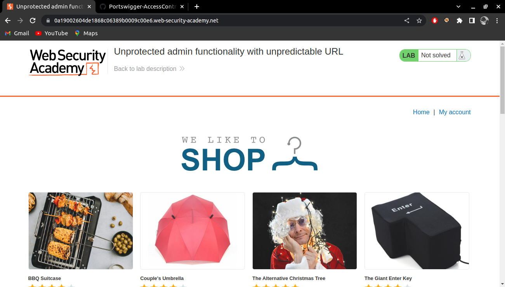
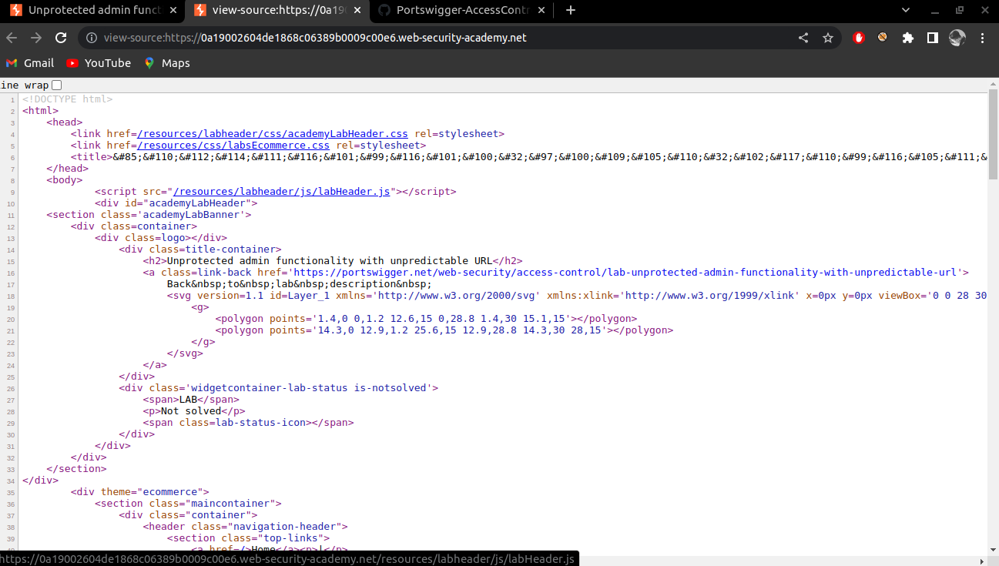
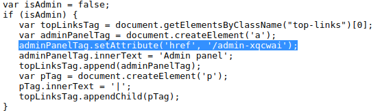
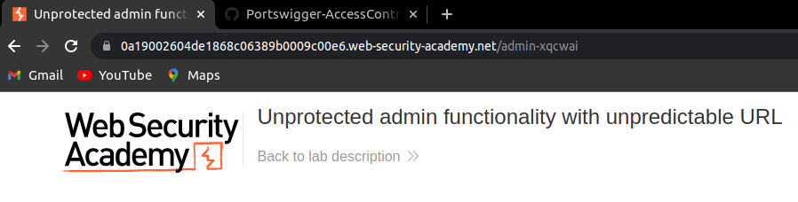
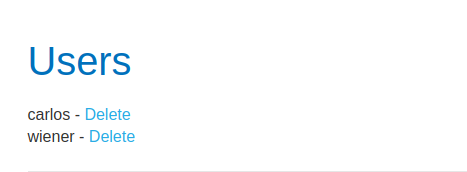
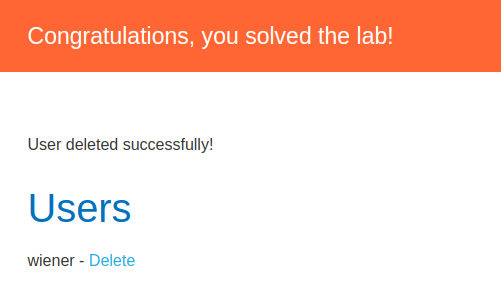

# Unprotected Admin Functionality with Unpredictable URL

> Category : Access Control

> LAB : https://portswigger.net/web-security/access-control/lab-unprotected-admin-functionality-with-unpredictable-url

## Description

This lab has an unprotected admin panel. It's located at an unpredictable location, but the location is disclosed somewhere in the application.

Solve the lab by accessing the admin panel, and using it to delete the user carlos.

## WriteUp

1. Enter the lab and you will see the home page.
   
   

2. Use combination **CTRL + U** to see the page source.
   You will see something like this:

   

3. Scroll down until you find some JavaScript code. Look at the code, you will see the line  ``adminPanelTag.setAttribute('href', '/admin-xqcwai');``.

    

4. Back to home page and add the **/admin-xqcwai** after the URL. Now you will enter the admin panel page.
   
    

5. According to the Description, delete user **carlos**.
   
   

6. And boom, the Lab has solved.
   
   