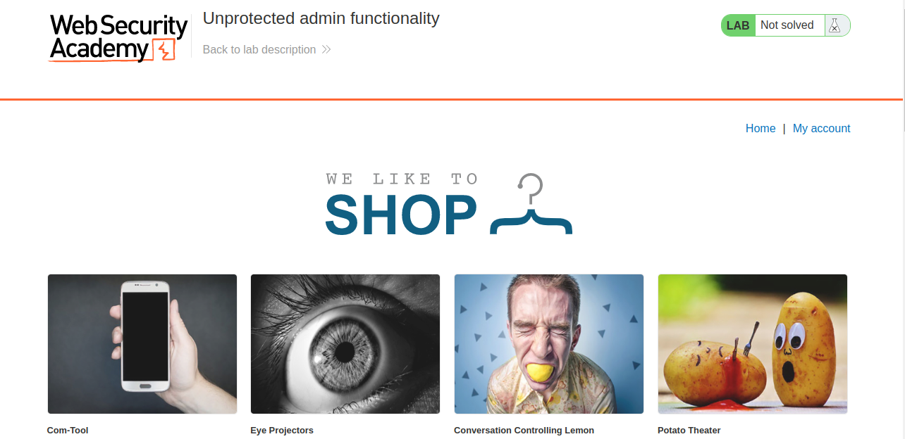
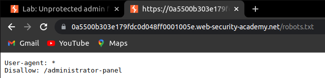
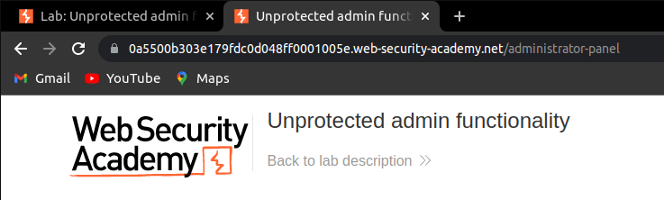
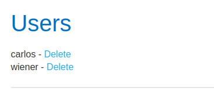
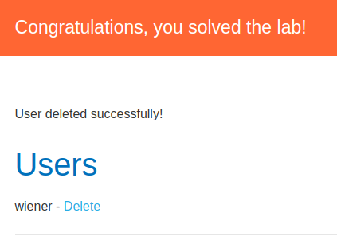

# Unprotected Admin Functionality

> Category : Access Control

> LAB : https://portswigger.net/web-security/access-control/lab-unprotected-admin-functionality

## Description

This lab has an unprotected admin panel.
Solve the lab by deleting the user carlos.

## Write Up

1. Click on "Access Lab" to enter the lab.
   
2. The page will look like this:
   
   

3. Add **/robots.txt** after the url and dissalow page will show up:
   
   

4. Replace **/robots.txt** with **/administrator-panel** after the url.
   
   

5. After you enter the administrator panel, you will see there are 2 users in the screen. According to the Description, delete user with name **carlos.**
   
   

6. Task complete.
   
   