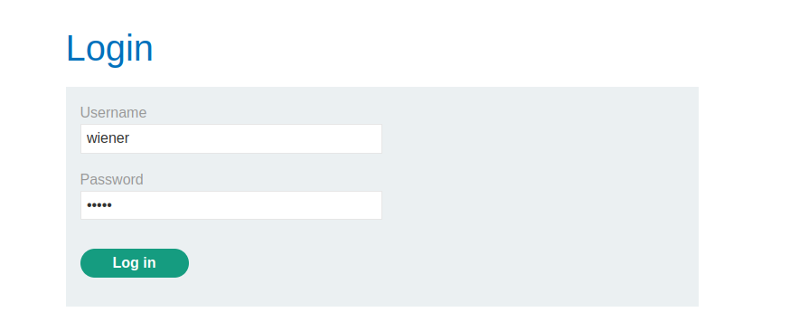
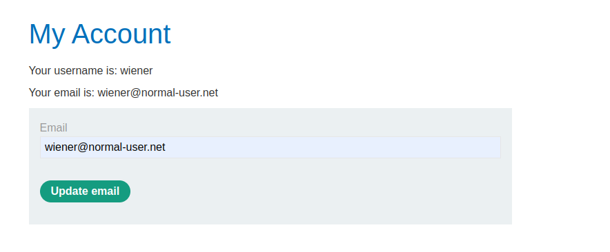
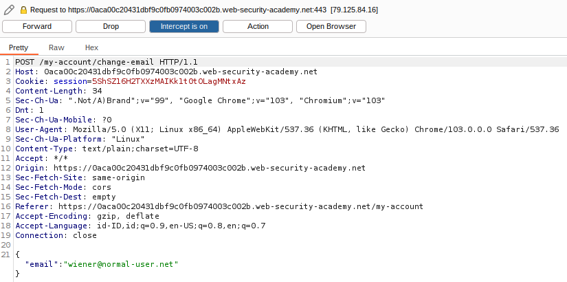
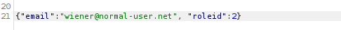
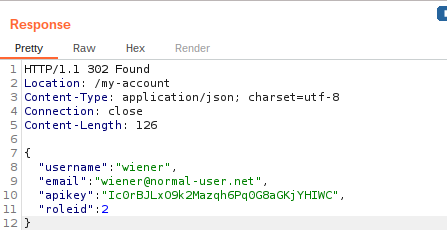
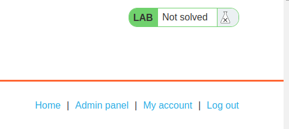
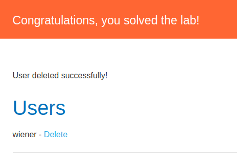

# User Role Can Be Modified in User Profile

> Category : Access Control

> LAB : https://portswigger.net/web-security/access-control/lab-user-role-can-be-modified-in-user-profile

## Description

This lab has an admin panel at /admin. It's only accessible to logged-in users with a roleid of 2.

Solve the lab by accessing the admin panel and using it to delete the user carlos.

You can log in to your own account using the following credentials: wiener:peter.

## WriteUp

1. Access the lab and go to **My Account**. Use wiener:peter to login.
   
   

2. Start your BurpSuite enable Proxy Intercept. Back to the browser use default email of wiener and click **Update Email**. 
   
   

3. The Intercept will get the HTTP request and it will look like this:
   
   

4. Click on the Action and Send to Repeater. In the bottom of HTTP Request, you will see the email in JSON format. Add ```"roleid":2``` after the email.
   
   

5. Click **Send** and the roleid will change to 2.
   
   

6. Back to the Browser, you will see the Admin Panel. Click on the Admin Panel.
   
   

7. Delete user with name Carlos and the Lab will Solved.
   
   