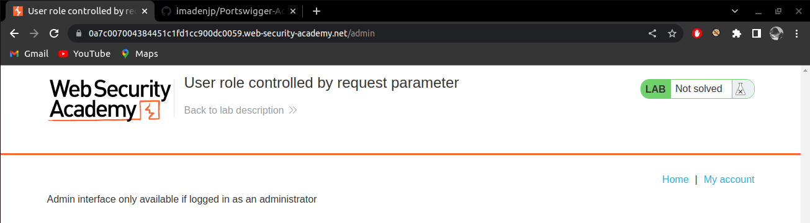
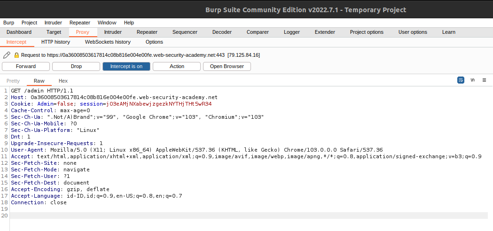
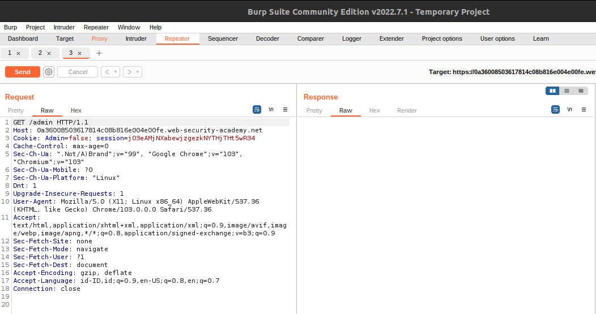
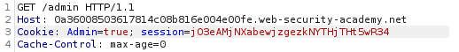
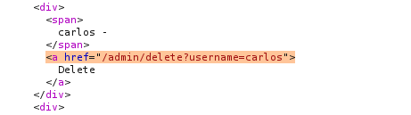
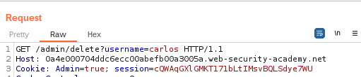
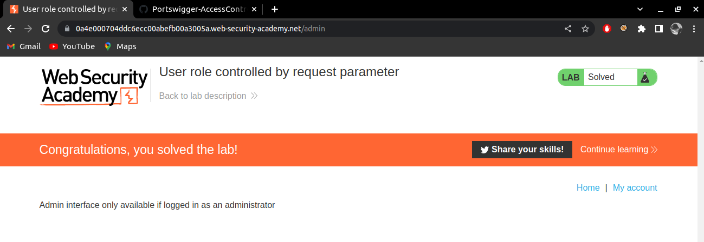

# User Role Controlled by Request Parameter

> Category : Access Control

> LAB : https://portswigger.net/web-security/access-control/lab-user-role-controlled-by-request-parameter

## Description

This lab has an admin panel at /admin, which identifies administrators using a forgeable cookie.

Solve the lab by accessing the admin panel and using it to delete the user carlos.

You can log in to your own account using the following credentials: wiener:peter.

## WriteUp

1. The lab has admin panel at **/admin**, but you can't access it.
   
   

2. Open BurpSuite and use proxy intercept. Use Admin Panel URL again and you will get the cookies.
   
   

3. Click on the **Action** button and use **Send to Repeater**.
   
   

4. On the **cookie**, change the Admin to **true**.
   
   

5. Click **Send** and you will get the respone on the right sidebar. Scroll down and you will get URL to delete username with name **carlos**.
   
   

6. Add the URL on the Request after the **GET /admin/**
   
   

7. Send it again and back to the LAB, you will see the lab has solved.
   
   